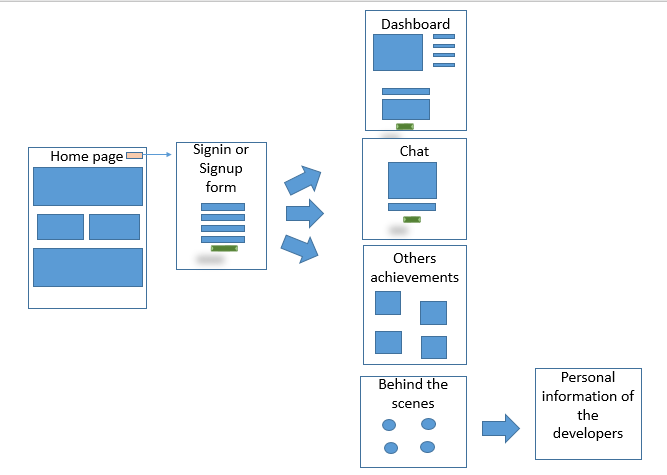
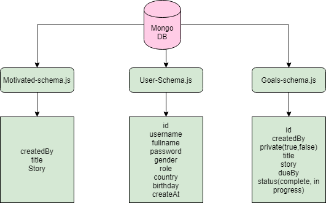
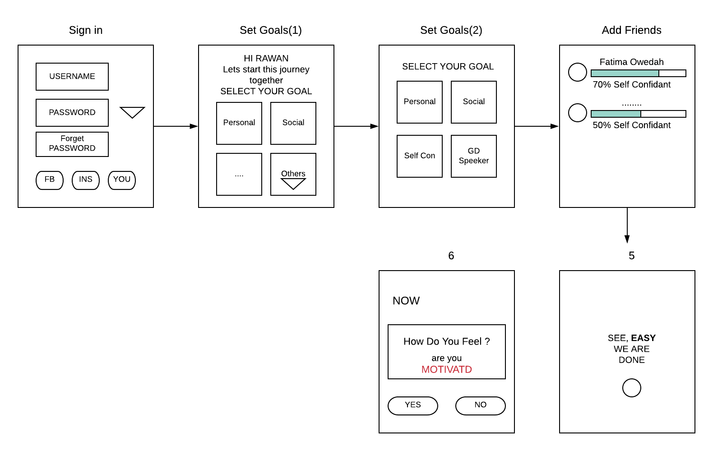
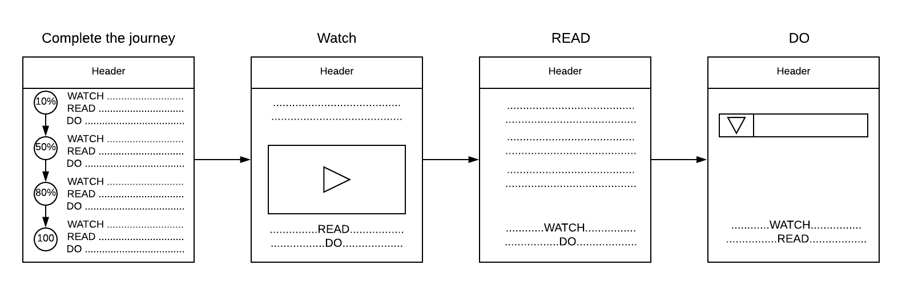
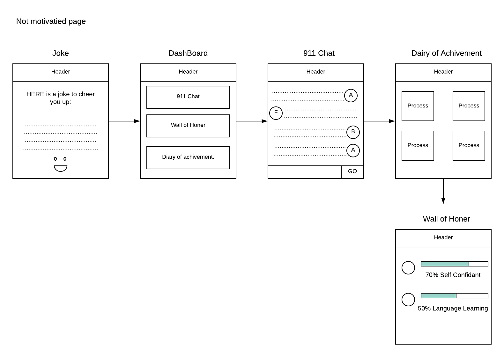
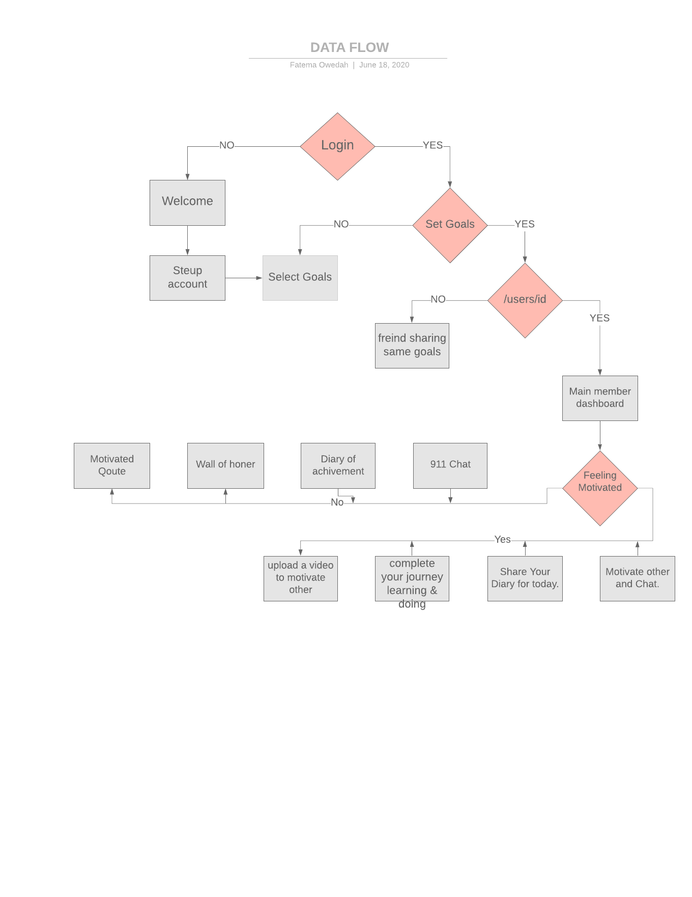

# Gadha 

## Team members  
 1. Israa Othman  
 2. Fatema Owedah  
 3. Anas Zain   
 4. Ammar Badwan  

## Trello 
  [Trello](https://trello.com/b/sw0kMHjP/graduation-project)

## The Idea of the project  
  it is a motivational app that motivates the users to move on in their lives, to achieve their goals, to reach success  
  also, they can see other people success stories or achieved goals from other users  
  they can publish their own stories so others can motivate from them  

## Vision 
 

## WireFrame
 

## Domain Modeling  
  

## Database  
  

## User Stories 
 [Trello UserStories](https://trello.com/c/FqU6qior/34-stories)

## stretch goals  
  - User will be able to login useing facebook 
  - Convert the web app language to Arabic
  - Posts Notifications 

## Future wireframe

  

