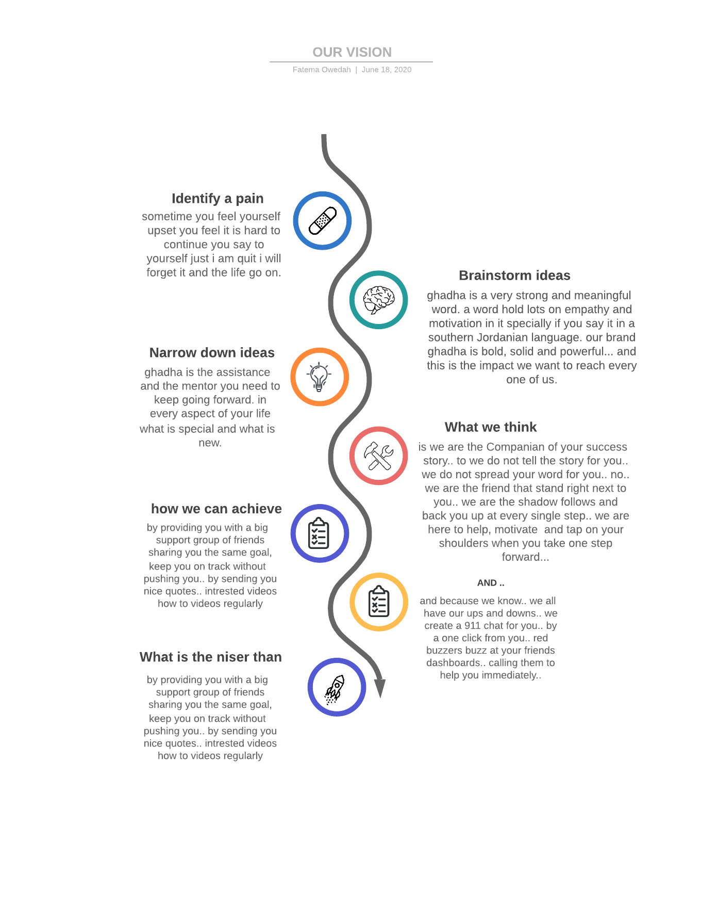

# Gadha App 

## Vision 
 

## Scope 
  - The web App provide you with a big support group of people sharing their goals and success stories 

  - The web App provide a real time chat between the users  

  - Users will be able to setup their goals and update them anytime  

  - Users will have a wall of their own acheivments  

  - Users will be able to see what other users acheive to encourage them 

## Functional Requirements 
- As a user, I want to create a new account so that I may later signin
- As a user, I want to signin to my account so that I may access protected information
- As a user, I want to signup/signin using a third party website so that I would have quicker access 
- As a user, I want to create new posts so I can save it on my dashboard   
- As a user, I want to UPDATE/DELETE my posts so that I can control my posts in every way  
- As a developer, I want to create an authentication server so that our application can restrict access to certain features
- As a developer, I want to use industry standards for http based basic authentication
- As a developer, I want to provide applications and users a token following authentication to facilitate re-authentication on subsequent requests
- As a developer, I want to protect specific routes on my server by requiring a valid token to access it
- As a developer, I want to CREATE a new record in (motivation/goals) document in a DB, using the POST method on the motivations/goals APIs.
- As a developer, I want the API to return the record I created in JSON format
- As a developer, I want to GET list of all records in (motivation) document in a DB, using the GET method on the motivations API
- As a developer, I want to GET  motivations for specific user ,using the GET method with a username parameter on a motivations API
- As a developer, I want to UPDATE an existing record in a database, using the PUT methods with an ID parameter on the APIs
- As a developer, I want to DELETE an existing record in a database, using the DELETE method with an ID parameter on a custom API

## Non-Functional Requirements 
  - Security  
    - long secret token key 
    - The token expires in 7 days 
    - High complexity hashed password
  - Testability  
